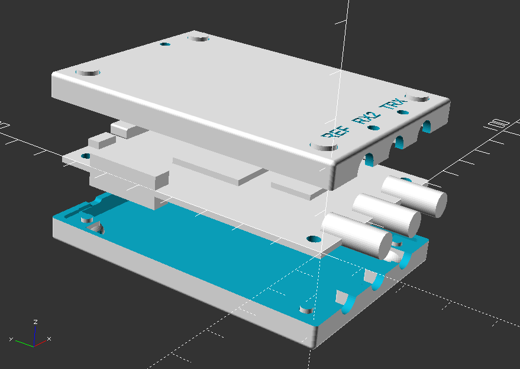
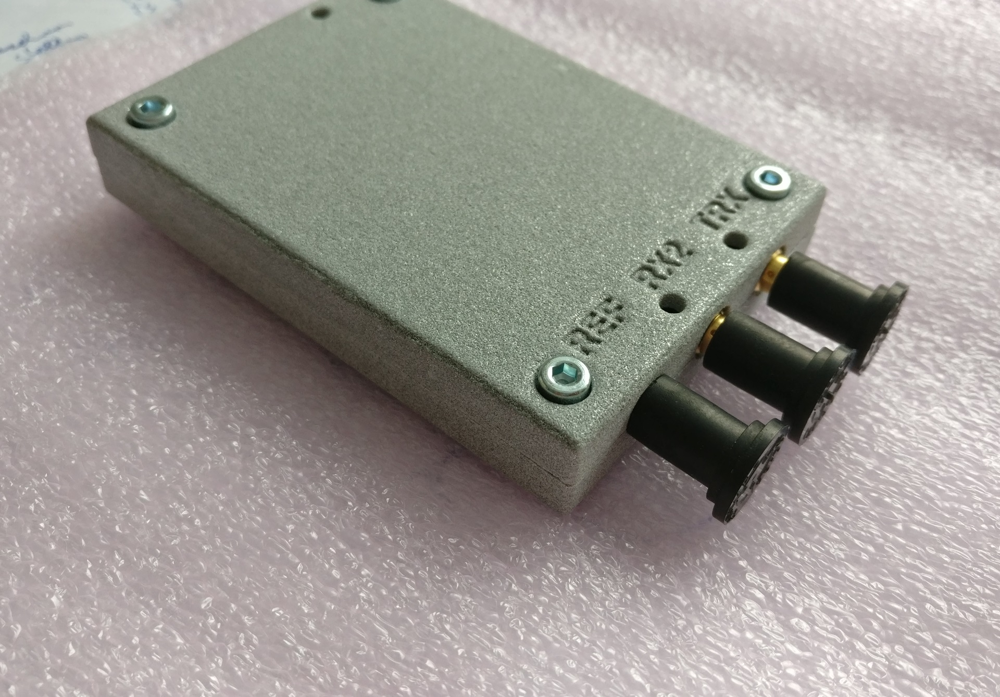
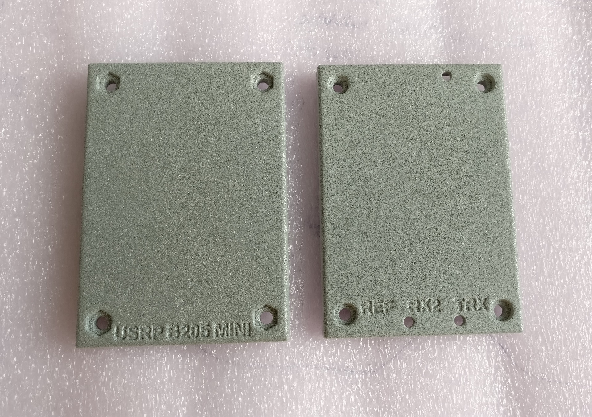
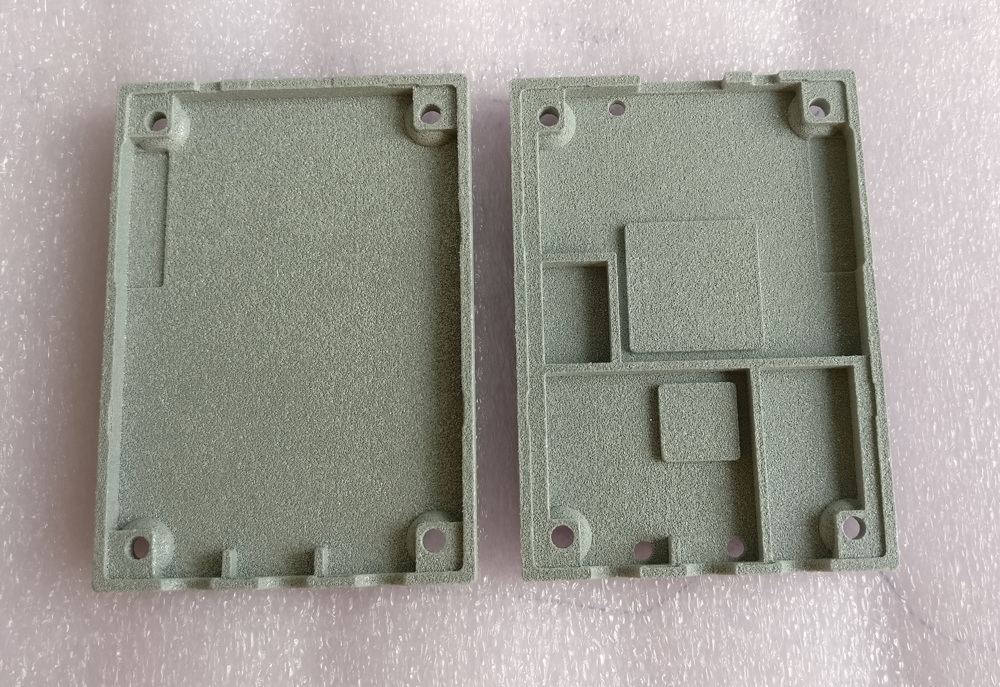

3D printable Enclosure for the Ettus Research B200mini and B205mini
===================================================================

## todo
- Shapeways
   - polished [metal plastic](https://www.shapeways.com/materials/metallic-plastic?li=nav) (alumide)
   - case top cost ~35€
   - case bottom costs ~31€
   - Result: very accurate print, tolerances not fully needed
   
- update link thingiverse
   - [thingiverse](http://www.thingiverse.com/thing:1892671)
   
- pics explosion

- pics real

- needed extra parts for assembly
   - 1mm Thermal Pad (Double Adhesive Heat Transfer) for FPGA and ADC
   - 4x M3 12mm cylinder Screws (hexagon socket)
   - 4x M3 Nuts (self-locking)
   - 3x 3mm [light pipes](https://www.conrad.de/de/lichtleiter-zur-frontplatten-montage-mentor-12822000-planar-183506.html)
   - conductive copper foil tape to shield the cages
   
- changes
   - reset hole could go 0.5mm to usb-port
      