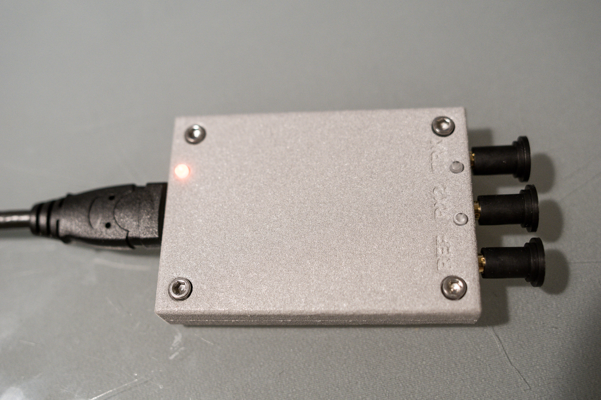
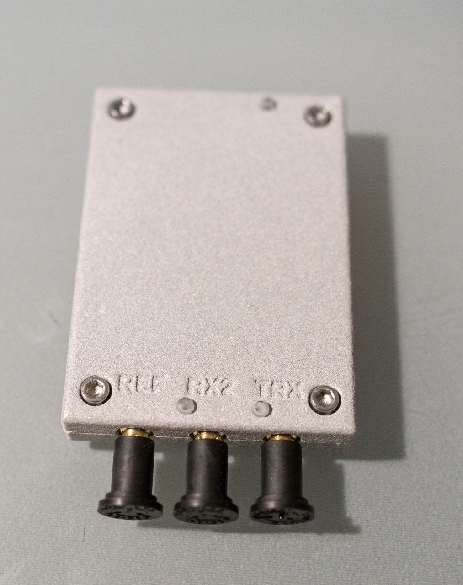
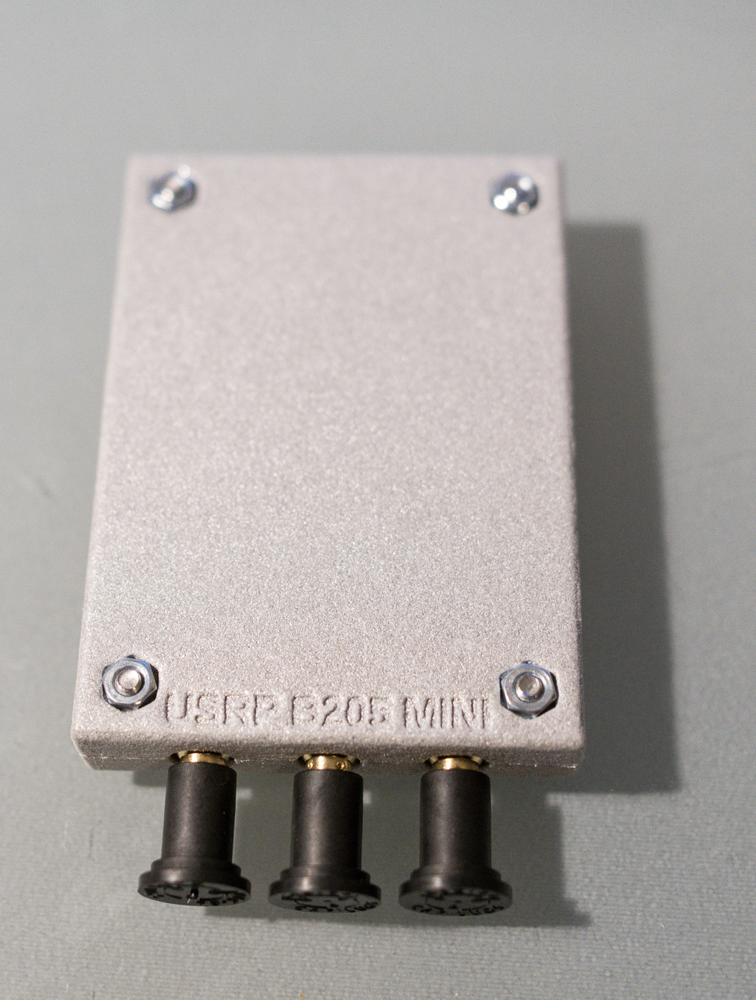
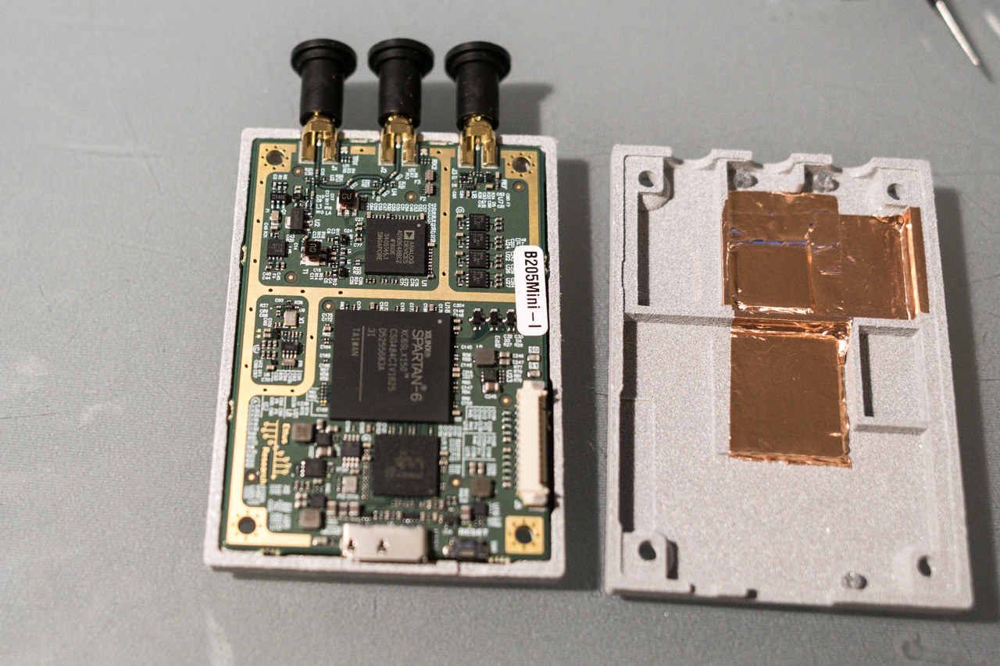
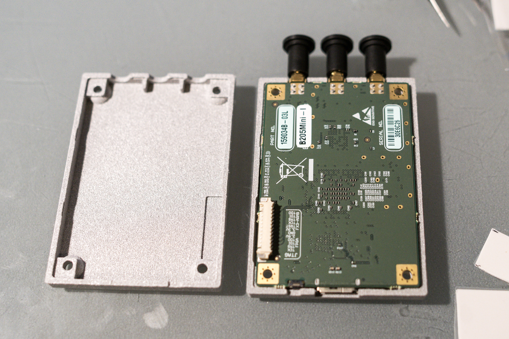

3D printable Enclosure for the Ettus Research USRP B200mini and [B205mini](https://www.ettus.com/product/details/USRP-B205mini-i)
===================================================================

This case is smaller and cheaper than the original case from Ettus. And you can modify it to show a logo or add other features. It was tested with an alumide-print from Shapeways and is now used for two USRPs.

## tested print from Shapeways
- polished [metal plastic](https://www.shapeways.com/materials/metallic-plastic?li=nav) (alumide)
- case top cost ~35€
- case bottom costs ~31€
- Result: very accurate print, included tolerances not fully needed

## extra parts for assembly
- 4x M3 12mm cylinder Screws (hexagon socket)
- 4x M3 Nuts (self-locking)
- 3x 3mm [light pipes](https://www.conrad.de/de/lichtleiter-zur-frontplatten-montage-mentor-12822000-planar-183506.html)
- Thermal Pads 1mm thick (Double Adhesive Heat Transfer Pads) for FPGA and ADC
- conductive copper foil tape to shield the cages (optional)
   
## Pictures

  

## todo
- update link [thingiverse](http://www.thingiverse.com/thing:1892671)
- possible changes
   - reset hole could go 0.5mm to usb-port
      